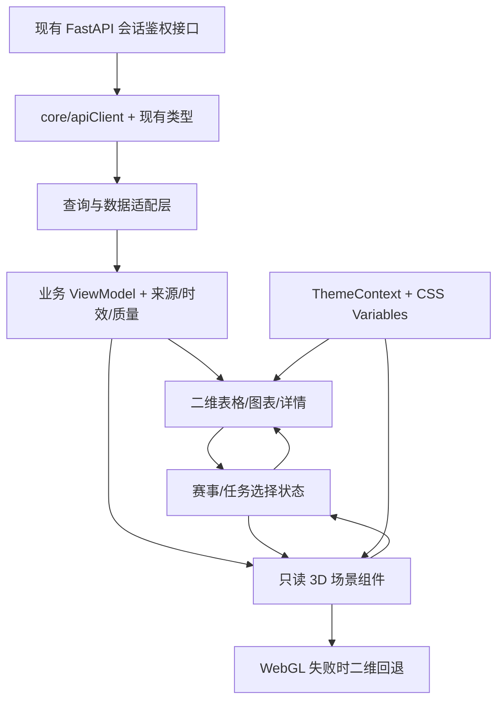

# FQP 赤焰量化指挥中心改造方案

日期：2026-10-08｜状态：方案草案，尚未实施

## 1. 方案结论

将现有 FQP 增量升级为「足球量化终端 + AI 工作监控 + 3D 分析入口」。建议先交付赤焰设计系统、今日工作台和可交互球场，再建设 Agent 数字孪生、业务数据管线、战术实验室及模型研究场景。

3D 用于选择赛事、理解任务关系、查看阵型和进入详情；概率、赔率、收益、回撤和样本统计继续使用二维图表与表格。每个 3D 页面同时拥有完整的二维操作入口。

任务分类：产品与前端架构改造方案；总体风险：高；执行模式：STRICT。首个交付范围以前端和只读接口为主，后续涉及任务追踪、数据契约或数据库变动时逐项评审。

本次交付仅为方案文档。附件末尾的开发指令按用户本次「做一个方案」的要求处理；没有修改业务代码、安装依赖、执行测试、提交 GitHub 或变更生产服务。

## 2. 审计依据与边界

已读取用户附件及本地代码快照 `/private/tmp/fqp-pi-model-center`。本地 HEAD 为 `89f2930bebe5b5267da4fc50f251bfacafa6025c`，本地 `origin/main` 为 `74ebae2b11a3abda78abe851d95d58ee418e742c`，两者业务代码树一致。

上次部署已确认服务器运行上述主分支提交。本次为本地源码审计，没有重新连接服务器，因此不把生产阵容覆盖率、实时任务状态、浏览器性能或资源使用量列为本次已验证事实。

仓库 README 仍包含历史个人本机工作区和运行描述。实施时应以现行服务器发布流程为准，并更新过时部署说明。

### 已确认的架构

| 领域 | 当前实现 | 改造决定 |
|---|---|---|
| 前端 | React 19.2.7、TypeScript 6、Vite 8 | 复用当前项目和构建链 |
| 路由 | `core/router.ts` 自研 hash 路由 | 保留旧链接，按模块增量扩展 |
| 组件 | Card、DataTable、Modal、MatchDetailDrawer、ChartCard、空状态与加载组件 | 统一视觉、交互和状态契约，复用业务能力 |
| 图表 | ECharts 6.1.0、lightweight-charts | 保留精确统计与时间序列展示 |
| 状态 | React Hooks、Context；类型化 API 客户端、GET 请求去重 | 新工作台引入统一查询层，旧页面逐步迁移 |
| 主题 | 12 套主题、CSS Variables、ThemeContext、本地持久化、密度与动效设置 | 升级现有默认 redline-quant 为赤焰，保留全部主题 |
| 页面加载 | App 已使用 lazy / Suspense | 3D 单独分包，沿用页面懒加载 |
| 后端 | Python 3.14、FastAPI、PostgreSQL、Redis | 扩展只读数据契约；浏览器仅访问 API |
| 鉴权 | Redis 会话与后端 HTTP AuthMiddleware | 新接口沿用会话；未来推送另做连接鉴权 |
| 定时生产任务 | Scheduler / Worker、任务记录、心跳及超时诊断 | 3D 展示实际执行记录 |
| 模型接入 | 服务端 Pi 统一供应商、账号登录、模型绑定与调用审计 | 沿用现有接入；展示配置就绪和实际调用状态 |
| 发布 | GitHub CI、服务器 systemd、Nginx 静态资源 | 分阶段提交部署，主分支与服务器版本一致 |
| 实时能力 | 已有 30 秒后台刷新 Hook；未发现 WebSocket 路由 | 首版轮询，推送能力后置 |

### 关键差距

1. 没有 Three.js / React Three Fiber 场景层。
2. `/api/ops/pipeline` 有当前任务状态、完成时间和质量摘要，但没有完整执行详情。
3. `/api/ai-jobs` 返回执行 ID、负责人、状态、开始结束时间、耗时与错误；当前列表没有返回 `input_snapshot_refs`、`output_refs`。仅凭两个任务先后完成，不能证明发生了数据传输。
4. `/api/agents` 注册信息、`agent_tasks` 协作任务、`ai_job_runs` 定时任务、`agent_workspace_tasks` 模型分析归档属于不同对象。后者主要保存成功响应，不应被解释为完整实时执行轨迹。
5. 阵容和伤停接口已经存在，但当前阵容摘要接口缺少来源，比赛详情中的阵容对象缺少快照时间和来源。球员明细含位置类别与战术角色，未提供精确场上坐标和球衣号码。仍需检查实际采集质量和覆盖率。
6. 当前 Layout 尚无完整的全局数据状态栏与通知聚合。通知首版基于已有异常和任务记录，不单独建设消息服务。

## 3. 产品结构与导航

保留当前路由、历史入口和已有模块开关。左侧按四组组织导航，避免将 14 个入口同时铺成无分组长列表。

| 分组 | 目标入口 | 当前对应 / 方案 |
|---|---|---|
| 核心业务 | 今日工作台 | `/`，升级 DashboardPage |
| 核心业务 | 赛事中心 | `/matches`；赛事目录 `/events` 保留为关联入口 |
| 核心业务 | AI 预测中心 | `/analysis`，复用赛前分析与预测展示 |
| 核心业务 | 赔率雷达 | `/odds`，升级 OddsMovementPage |
| 核心业务 | 模拟投注中心 | `/betting`，保留彩票、实票上传、对抗资金池等子功能 |
| 核心业务 | 赛后复盘 | `/reports` 的复盘内容；旧 `/reviews` 重定向保留 |
| 研究分析 | 球队战术分析 | 拟新增 `/tactics`，与比赛详情双向跳转 |
| 研究分析 | 回测中心 | `/backtest` |
| 研究分析 | 模型研究 | `/models`，增加可关闭的结构关系场景 |
| 研究分析 | 足球新闻 | `/news-intelligence` |
| 研究分析 | 冷门研究 / 传统足彩 | `/upsets`、`/pool` 原功能继续可达 |
| 智能任务 | AI Agent 数字孪生 | 拟新增 `/digital-twin`；复用 `/agents` 执行详情 |
| 智能任务 | 智能分析工作台 | `/agent-workspace` 保留人工发起与结果归档 |
| 智能任务 | 报告中心 | `/reports` 的报告与归档标签，不复制一套报告数据 |
| 系统管理 | 数据中心 | 复用 `/feature-snapshots` 与现有数据健康内容；必要时增加聚合入口 |
| 系统管理 | 系统监控 | `/data-health` |
| 系统管理 | 系统设置 / 模型接入 / 功能模块 | `/settings`、`/model-providers`、`/modules` |

以上新路由属于拟议设计，尚未创建。路由和菜单同步更新 `panelRegistry.ts`、配置注册表及后端 UI 注册规则，保留禁用模块行为。不要仅修改静态侧栏，导致后端运行时菜单重新覆盖。

## 4. 视觉设计与今日工作台

### 赤焰主题

沿用 `redline-quant` ID 和用户本地设置键，主题显示名更新为「赤焰量化指挥中心」。已有用户的其他主题选择保持有效。

| Token 用途 | 默认值 / 规则 |
|---|---|
| 页面背景 | `#0B0F16` |
| 主面板 | `#171D27` |
| 品牌与选中状态 | `#F34F62` |
| 强调与关注提示 | `#F4B15E` |
| 文本 | 高对比度浅色；次级文字单独定义并测量对比度 |
| 成功、失败、等待、不可用 | 独立语义 Token，文字和形状共同提示 |
| 数字 | 等宽数字、固定小数口径与单位；金额来源保持分离 |
| 边框与背景 | 细边框、轻网格、低强度光效 |

在原有 `--fqp-*` 变量上增加场景 Token，如球场、边线、选中节点、任务管线。3D 从主题适配器读取颜色，不能在 Mesh 中散落固定颜色。CSS 色值转换遵循渲染器颜色管理，避免 2D/3D 明显色偏。

红色同时是品牌色和失败色，因此故障必须附错误图标、状态文字和详情入口，不能依靠颜色辨认。盈亏继续遵循现有 financialColorMode；任务完成状态与收益正负是不同含义。

正文以清晰中文系统字体为主；统计数字使用等宽字体。无需依赖外部字体 CDN。密集表格仍需可读字号、清晰行距、可见焦点和键盘入口。

### 桌面布局示意

```text
┌───────┬─────────────────────────────────────────────────────┐
│ FQP   │ 业务日期  官方数据状态  快照时间  任务状态  通知  外观 │
│       ├─────────────────────────────────────────────────────┤
│ 导航  │ 今日赛事 │ 预测覆盖 │ 赔率更新 │ 模拟资金 │ 待复盘    │
│       ├─────────────┬─────────────────────┬─────────────────┤
│       │ 赛事列表    │ 3D 球场 / 2D 总览   │ 已选赛事分析    │
│       │ 日期/筛选   │ 赛事节点与镜头控制  │ 预测/赔率/证据  │
│       ├─────────────┴─────────────────────┴─────────────────┤
│       │ 模型表现/赔率趋势 │ Agent 执行摘要 │ 数据异常       │
└───────┴─────────────────────────────────────────────────────┘
```

这是布局示意，不是业务数据演示。图表、任务卡片和场景布局根据容器宽度调整。

1920×1080 为设计参考：可折叠侧栏建议 216–240px，右侧分析栏建议 320–380px，中间使用 `minmax` 分配空间。低宽度时收起右栏为抽屉；手机默认二维赛事列表、详情和资金状态，可主动进入 3D。1440p/4K 增加数据空间，并控制文本行长和画布 DPR，避免把所有元素无限放大。1920×1080、2560×1440、3840×2160、1366×768、768px、390px 均列入验收矩阵。

### 工作台交互

- 赛事列表、3D 节点、右侧分析面板共用 `selectedMatchId`，切换来源不会重复请求同一比赛详情。
- 球场上的赛事节点代表赛事入口，按开赛时间或筛选结果排布；不代表球员位置或真实赛事地理位置。界面明确说明布局含义。
- 悬停只展示轻量摘要；点击选中，键盘列表能完成相同操作。
- 2.5D、俯视、自由镜头、重置、画质、减少动效均有显式控制。
- 节点排序优先时间和用户筛选。重点赛事依据已有可信指标，不新增未经确认的综合评分。
- 预测、赔率和可用玩法通过详情数据加载；阵容或赔率缺失时按模块显示空状态，不阻断整张赛事卡。
- 业务日期以现有后端口径为准，展示时间转换为 Asia/Shanghai；不能把浏览器自然日直接代替官方业务日。

## 5. 技术选型与依赖策略

| 项目 | 方案 | 原因 |
|---|---|---|
| Three.js | 新增，WebGL 2 渲染基础 | 满足交互球场和空间节点需求 |
| React Three Fiber | 新增稳定 9.x 系列，实施时精确锁版 | 官方文档明确 9.x 对应 React 19；避开当前 10 alpha |
| drei | 按需使用相机控制等组件，版本匹配 R3F | 降低重复建设控制与辅助组件的成本 |
| `@types/three` | 开发依赖 | TypeScript 类型支持 |
| TanStack Query | 推荐在新工作台小范围引入 | 管理查询缓存、更新和分页；沿用 API 客户端鉴权与超时 |
| Zustand | 首期不加入；Context / reducer 管理选择与镜头 | 联动范围有限时已有状态工具足够 |
| Tailwind / shadcn/ui | 首期保留现有 CSS 与公共组件 | 当前没有对应依赖，全面迁移会扩大视觉改造范围 |
| ECharts / lightweight-charts | 继续复用 | 已有模型、资金、赔率图表 |
| WebSocket | 首期轮询；后续根据实测需求评估 SSE 或 WebSocket | 当前没有推送接口，先保证真实状态和可追踪性 |
| 物理引擎、重后处理、外部 3D 大模型 | 暂不加入 | 当前球场与节点网络无需这些能力 |

上表为选型建议，不是已安装依赖清单。实施前重新检查 peerDependencies、Node 24、React 19、Vite/TypeScript 兼容性、许可证、安全审计和分包体积，锁定 package-lock；不凭本方案安装任意 latest。

TanStack Query 只缓存只读业务数据，不缓存密钥或登录授权内容。新工作台有一个统一刷新负责人，避免现有后台刷新 Hook 和 Query 同时轮询同一资源。请求去重不能被误认为长期缓存；需要明确 staleTime 与数据来源时效。

参考：[R3F React 版本匹配](https://r3f.docs.pmnd.rs/getting-started/introduction)、[R3F 按需渲染与性能](https://r3f.docs.pmnd.rs/advanced/scaling-performance)、[TanStack Query 服务端状态管理](https://tanstack.com/query/latest/docs/framework/react/overview)。查询日期：2026-10-08。

UI/UX 技能搜索未得到完整匹配量化工作台的信息结构：生成结果包含营销页模板，因此不采用其页面布局和配色。本文采用用户指定主题、仓库既有组件及技能通用的可读性、键盘操作、减少动效规范。

## 6. 增量前端架构



拟议文件组织，实际文件名实施时按代码规模收敛：

```text
apps/frontend/src/
  app/layout/                 # 升级现有 Layout / Sidebar，增加全局状态栏
  core/apiClient.ts           # 保留接口入口及 HTTP 语义
  core/types.ts               # 复用现有类型；新业务类型按 feature 拆分
  theme/                      # 升级现有主题，增加 3D Token 映射
  features/command-center/    # 工作台查询、ViewModel、选择状态
  features/digital-twin/      # 执行状态映射、追踪关系、节点选择
  features/tactics/           # 阵容证据、布局、球员详情
  visualization/scene/        # Canvas、相机、主题、资源/性能、回退
  visualization/football/     # FootballPitch、MatchMarker、阵型覆盖
  visualization/agents/       # AgentNode、AgentNetwork、可信连接
  visualization/pipeline/     # 批次节点、证据关系、运行/回放模式
  visualization/models/       # 模型结构场景，与现有 model 图表区分
  pages/DashboardPage.tsx     # 升级已有页面
  pages/DigitalTwinPage.tsx   # 拟新增
  pages/TacticsPage.tsx       # 拟新增
```

共享层只抽取被两个以上场景使用或生命周期确实复杂的组件。首期不一次创建附件列出的全部类和组件。

SceneCanvas 负责生命周期、错误边界、WebGL 检测和容器尺寸；ScenePerformanceManager 负责画质与渲染节奏；业务 Hook 负责 API；Selection 负责交互；场景 Mesh 只接收 ViewModel 和事件回调，不直接 fetch。

## 7. 数据接入：已存在、待扩展、待确认

| 展示内容 | 已确认接口 | 首版接法 / 缺口 |
|---|---|---|
| 今日 KPI | `/api/dashboard/today` | 保留后端业务日、覆盖口径和资金来源 |
| 赛事列表 / 详情 | `/api/matches/today`、`/api/matches/active`、`/api/matches/{match_id}/detail` | 统一选择和详情缓存；筛选范围需与 KPI 一致 |
| 官方快照与采集状态 | `/api/official/collection-status`、`/api/official/matches/{match_id}/odds-snapshots` | 同时显示采集时间、快照时间、来源与验证状态 |
| 赔率趋势 | `/api/dashboard/odds/movements`、`/api/official/odds-index` | 复用当前玩法和历史日期约束 |
| 模型预测 / 版本 | `/api/predictions`、`/api/models/versions`、`/api/models/overview` | 区分统计预测模型与 Pi 接入的语言模型 |
| 模型表现 | `/api/analysis/evaluation/history` | 复用已修复缓存与样本口径，不以场景刷新高频重算 |
| 特征快照 | `/api/features/snapshots` | 保留快照 ID、时间和与预测的关联 |
| 任务与心跳 | `/api/agents`、`/api/agent-tasks`、`/api/ai-jobs`、`/api/agent-scheduler-status` | 按对象类型映射；启用配置不等于任务正在运行 |
| 管线与异常 | `/api/ops/pipeline`、`/api/agent-stale-jobs`、`/api/agent-stale-tasks` | 先展示已有状态，缺少执行关联时显示「未记录」 |
| 人工模型分析 | `/api/agent-workspace/tasks`、`/api/model-providers/invocations` | 展示归档和调用审计；不凭归档构造执行过程 |
| 阵容 / 伤停 | `/api/enrichment/lineups`、`/api/enrichment/injuries`、比赛详情 | 扩展只读返回以携带来源、时间、可验证字段；号码/坐标缺失则不显示 |
| 彩票与结算 | `/api/betting/tickets`、`/api/betting/results` | 保留游标分页、票据来源、待结算原因和资金隔离 |
| 回测 | `/api/backtests`、`/api/backtests/{run_id}/equity-curve` | 继续使用归档赛前证据与后端统计 |
| 复盘 / 报告 | 当前 ReviewsPage 的 api.reviews、reportAutomation 查询 | 复用现有日报、周报、月报与归档组件 |

### 建议的只读契约扩展

拟新增执行详情/追踪读取能力（最终路径由接口设计确定，当前不存在）：

- 执行 ID、对象类型、jobCode/agentCode、原始状态与归一化状态。
- startedAt、finishedAt、durationMs、observedAt、最后一次真实更新。
- 输入、输出的允许字段摘要；模型版本、快照引用、票据或回测引用。
- 有证据时返回上下游执行/产物引用及批次标识；无证据时返回 null 和原因。
- 服务端对错误与摘要做脱敏、截断；不能把原始 prompt、环境变量、令牌或任意日志全部传到浏览器。

优先读取既有列，例如 ai_job_runs 中已有的引用 JSON，不为图形展示新增数据库。若生产记录不足以形成关联，先建设只读状态图；持久化追踪/事件为独立后端增量，明确评审、迁移和验收后再做。不能用时间相邻、同一赛事或同一负责人自动推断因果关系。

### 统一状态模型

查询状态：loading / ready / error；数据质量：valid / stale / missing / invalid；环境：production / demo；执行状态另设 running / queued / succeeded / failed / skipped / cancelled / unavailable / unknown。

将查询失败与缓存旧数据分别表达：请求失败时保留旧数据，但标注更新时间和错误。缺失概率显示「暂无」，缺失金额不默认显示 0。跳过和取消不映射为成功；注册启用不映射为正在运行；页面刚进入时也不自动显示任务已完成。

新 DTO 的时间使用带时区 ISO 8601；历史字段按已确认存储口径在后端统一转换，浏览器不猜测 naive 时间属于哪个时区。运行时长由后端真实开始时间计算，并标记为截至当前的运行时长，而非虚构百分比进度。

## 8. 五个 3D 场景的具体范围

### 8.1 足球量化总控中心——首个版本

低多边形球场、边线、球门和简化看台；场外少量网格，不使用持续装饰性粒子。支持镜头预设、有限旋转/平移/缩放、赛事节点选择、详情联动、主题同步、二维模式。

默认只绘制筛选范围内可读数量的节点；赛事增多时分组、分页或聚合，不把全部历史赛事放进一个场景。节点布局只服务赛事导航。

### 8.2 Agent 数字孪生中心

节点来源于真实注册表、生产任务定义和 Pi 模型绑定。静态职责网络可存在，但以「配置关系」标记；真实执行记录单独叠加。

必须区分：后台采集/预测/结算任务、协作任务、LLM 分析角色。没有对应注册和执行记录的示例 Agent 不自动生成。

状态节点展示最近执行及完整时间；详情提供任务 ID、责任对象、模型绑定、错误摘要和证据入口。默认 10–15 秒轮询活跃执行，概览 30–60 秒；失败指数退避到 60 秒，页面隐藏停止轮询，恢复后立即刷新。具体间隔按生产查询开销调优。

节点运行光环表示真实任务执行中。沿连接的传输动画只在有后端传输/产物消费证据时出现；已有接口仅提供开始结束时间时，用状态高亮表达。历史回放必须显式标为「回放」，不能混入当前运行模式。

心跳中断、数据过期或证据未知时停止持续运行/传输动画，并提示最后观测时间，避免旧 running 状态长期看似正常。

### 8.3 数据流与任务管线

官方快照 → 校验 → 特征快照 → 模型预测 → 策略评估 → 模拟投注 → 结算 → 回测/复盘。

首个任务图允许只展示「设计流程 + 已知记录状态」，但设计流程不代表这些节点已经真实相连。后续依据引用证据提供具体执行链，可按赛事、任务、日期或批次选择。

部分数据缺失时保留断点和缺失原因；每个节点点击打开已有记录页。数据产物关系与任务触发关系分开绘制，防止把模型版本关系或快照共享关系误画为数据流。

### 8.4 战术实验室

分三层交付：

1. 阵型、可验证球员名单、伤停及来源时间。
2. 有可靠位置类别时，展示「阵型示意」，球员排布采用明确标注的示意布局，不宣称实际站位。
3. 只有真实位置/事件数据可用时，增加实际位置、攻防分布或热图。

球员号码仅在可靠来源存在时展示；当前 playerId 不能当球衣号码。官方首发、历史阵容、预估名单使用不同标签。无可靠首发则显示数据不足，仍可浏览球队、伤停和已有模型特征。

不能根据预测概率生成看似真实的攻防热图；当前阵容、历史特征和赛前预测分别标注用途及时间。展示最新情报不能反向覆盖历史回测的赛前证据。

### 8.5 模型研究实验室

3D 展示模型版本、特征类别、输出及策略关系；命中率、ROI、Brier、LogLoss、回撤、覆盖率、样本量均在原有二维组件显示。

统计预测模型和语言模型使用不同节点类型。模型输出只有玩法、选项、赛事和快照口径一致时可比较；无可比证据时展示不可比原因，不自动补值或归一成一个排名。

## 9. 业务口径与长期稳定性

- 每日 500 元虚拟预算继续由后端账户与业务日规则控制。前端不自行重置，不将实票和用户模拟金额合并进 Agent 虚拟池。
- 玩法 HAD / HHAD / CRS / TTG / HAFU 沿用既有能力、合法选项与赔率证据。不支持的玩法显示原因。
- 新工作台的数据加载、相机操作、节点选中不触发预测、模型收费调用、创建彩票、结算、回测或任务执行；这些动作通过原有明确操作流程发起。
- 保留现有票据来源、分页、未结算诊断、实票上传、模型曲线、新闻证据、报告归档以及 Pi 供应商登录。
- 3D 场景异常仅回退对应场景，不能把整页业务白屏；未授权接口仍返回 401。
- Demo Mode 后置；如建设，数据文件、请求层和资金操作入口隔离，始终显示演示标识。

## 10. 性能预算与验收方式

以下都是拟定预算，尚无本次实测结果。实施后用指定硬件和数据量记录基线，必要时调整预算并说明理由。

| 指标 | 初始目标 |
|---|---|
| 3D 加载 | 用户未进入或开启场景时，不请求场景运行时与重资源 |
| 并存场景 | 通常只保留一个活动 Canvas；切换场景释放不再使用的资源 |
| DPR | 低 1；中不高于 1.5；高不高于 2；自动按持续性能退化降级 |
| 绘制预算 | 中档首版球场/节点场景优先控制在约 100 draw calls 内，复杂页重新测量 |
| 动态效果 | 限制活跃连接和粒子数量；低画质关闭阴影与装饰效果 |
| 渲染节奏 | 默认 demand；仅交互或可见且可信的活动状态请求后续帧 |
| 场景不可见 | 停止无关渲染和轮询；数据恢复时标注新观测时间 |
| 交互流畅度 | 参考桌面中档硬件交互时争取 50–60 FPS；低档争取 30 FPS，失败可降级为二维 |
| 耐久性 | 连续运行 2 小时并切换场景 30 次；对比 JS 堆、GPU 资源计数与帧耗时，无持续不回落增长 |
| 错误回退 | WebGL 2 不可用、context lost、资源加载失败均可回到完整二维页 |

共享几何体、材质和缓存资源要有明确所有权，避免一个组件 dispose 后影响其他场景。不再使用的 GPU 资源、事件监听、定时器、AbortController 和相机控制器都进入清理范围；查看显存时注明工具限制，不能将 JS 堆等同显存。

性能记录包括提交 SHA、设备、浏览器、画质、节点/赛事量、冷/热加载、draw calls、帧耗时和资源计数。动画暂停和系统 prefers-reduced-motion 同时有效。

## 11. 实施阶段、依赖与估算

| 阶段 | 工作 | 交付边界 | 估算人日 |
|---|---|---|---|
| Phase 0 | 补齐运行态与数据覆盖审计 | 页面/API 清单、数据证据缺口、基线截图与性能记录 | 1–2 |
| Phase 1 | 赤焰设计系统、公共组件、全局状态栏 | 所有主题兼容，旧路由和功能可达 | 3–5 |
| Phase 2 | 3D 基础与球场 | 镜头、选择、主题、资源管理、二维回退 | 3–5 |
| Phase 3 | 今日工作台联动 | 真实赛事、KPI、赔率/预测详情、异常提醒 | 3–4 |
| Phase 4 | Agent 状态图与管线证据 | 状态图先交付，可信执行链分批增加 | 5–8 |
| Phase 5 | 业务页面、战术、模型研究 | 先业务二维升级，再战术证据，再研究场景 | 7–12 |
| Phase 6 | 综合性能、耐久性与分批发布 | 全链路验收、精确发布 SHA、静态资源及服务检查 | 3–5 |

累计约 25–41 人日，为单人等效投入估算，不能等同连续自然日承诺。首个包含真实工作台的版本约 10–16 人日。估算前提：核心接口可复用；不含新商业数据源接入、复杂位置追踪或未知生产数据修复。阵容数据和任务引用质量不足时，先交付准确的状态/空态和断点，完整能力另排期。

建议形成三个可用版本：

- V1：Phase 0–3，赤焰工作台 + 交互球场 + 完整二维模式。
- V2：Phase 4，真实 Agent 状态与有证据的数据管线。
- V3：Phase 5–6，业务页面升级、战术与模型研究、完整耐久验收。

测试与构建贯穿每个阶段，Phase 6 负责综合回归，不能到末期才发现依赖不兼容。

## 12. GitHub、部署和回退

1. 实施前从当前 GitHub 主分支创建隔离功能分支，记录代码及界面基线，不覆盖之前 Pi 集成的规划记录。
2. 每阶段只提交该阶段的实现和验证材料。设计系统、场景基础、工作台、Agent、业务升级分别形成可审查 PR；合并前 CI 和契约/交互验证通过。
3. V1 后面页面完成前保持新场景开关可关闭。用户可关闭 3D；发生场景故障时回到二维；接口/后端问题另走服务回退。
4. 新增 npm 依赖触发现有 deploy.sh 的依赖变更保护，需要单独准备依赖发布，再部署精确主分支 SHA。
5. 先构建暂存目录，再切换 Nginx 实际静态根 `/var/www/fqp`；验证 www-data 读取权限、HTML/JS 对应版本和旧 hash 链接。
6. 保留旧静态构建和旧代码 SHA；若新增只读后端字段，确保旧前端仍可使用。没有数据库迁移的发布可直接回退代码与静态资源。
7. 若追踪能力确需新增持久化结构，独立迁移设计，完成副本演练与恢复方案；不能为了场景效果顺带改业务表或清理历史数据。
8. 分批部署后检查登录、彩票列表与结算读取、模型曲线、Pi 接入、报告、就绪检查及三个服务状态，确认服务器 HEAD 与 GitHub main 一致。
9. 延续已经取消全量自动备份的要求。若发布流程需要备份，仅作当次人工发布备份，并明确路径、恢复用途及保留策略。

## 13. 风险与待确认项

| 风险 / 缺口 | 应对 |
|---|---|
| 阵容来源/时间缺失或首发覆盖不足 | Phase 0 查真实覆盖；只读契约补齐；不伪造球员 |
| 无精确站位、号码或事件数据 | 示意布局明确标注；实际热图后置 |
| 执行上下游引用不完整 | 保留断点；先状态图，再追踪记录增强 |
| Agent 角色与生产任务不一致 | 以注册/任务定义为准，明确节点来源与映射版本 |
| 高频轮询增加数据库负载 | 查询分组、限量、缓存、退避、隐藏暂停；实测再决定推送 |
| 大量 3D 和图表竞争浏览器资源 | 单 Canvas、分包、画质降级、资源复用和耐久验收 |
| 红色品牌与故障/盈亏混淆 | 图标、文字、颜色语义分离 |
| 新旧主题和菜单实现分裂 | 沿用 ThemeContext 与运行时注册表，保留原 ID/路由 |
| 后端返回敏感日志或模型输入 | 服务端白名单摘要、脱敏和长度限制 |
| 仅 3D 操作导致键盘或弱设备不可用 | 同步二维列表、可访问操作、完整回退 |
| 静态部署目录与代码构建目录不一致 | 检查真实 Nginx root、权限与资源 SHA |

推荐默认决策：保留 12 套主题，赤焰为默认；首期仅桌面默认启用 3D，手机以二维为主；首版轮询；不新增数据采购和数据库迁移；先完成 V1，再扩展其他场景。

## 14. 交付与验收

具体执行项见 `PLAN.md`，一对一验收见 `ACCEPTANCE.md`，阶段依赖见 `TASK_DAG.yaml`，可选能力见 `BACKLOG.md`。

本次已交付：源码审计结论、产品结构、视觉与交互规范、技术选型、真实数据契约缺口、阶段计划、性能预算及发布回退方案。

后续实施交付：各阶段实际修改文件清单、可运行代码、接口和数据来源说明、已运行验证与结果、构建及部署 SHA、未完成能力和缺口。计划中的指标与功能不得写成已完成结果。

## V2 接口与交互决策（2026-10-09）

使用现有数据库列，不修改任务写入链路。概览最多 200 条作业、50 条协作任务；不声称全量历史或全部运行中任务。详情读取一条执行，仅投影结构化数值引用、有限作业依赖和数值计数。依赖来自 input_snapshot_refs.dependencies，表示记录中的作业代码依赖；现有生产写入没有绑定上游 run_id，图中不冒称执行链。只读原始错误映射为固定提示，任何 URL、令牌、任意 result 文本不传浏览器。

首页工作台增加“赛事指挥台 / Agent 与管线”按钮，互斥卸载场景，复用现有颜色、镜头与按需渲染生命周期。注册节点和所属执行用不同几何形状；二维列表提供等价选择和全部记录，3D 仅最近 24 条。手动历史模式冻结当次概览数据，只能查看这些已记录状态；不重建某一历史瞬间的运行态，不播放虚构数据传输。

## V3a 比赛中心交互

沿用赤焰主题 Token，列表与二维证据双栏，窄屏按列表/证据顺序堆叠。原有整卡跳转改为显式“查看分析”按钮与完整详情链接，键盘可操作、选中状态有文字和语义。搜索/筛选有可见标签，空结果提供重置；真实空列表与错误不同。分页只覆盖已获取的至多 500 条，不冒充服务端完整翻页。统计仅汇总已获取数据，不对缺失赔率/完整度作零值推断。赔率快照与模型概率复用 V1 分组口径，不混合模型、玩法和预测时间。网络响应时间只称最近获取，不称来源更新时间。证据抽出独立模块，比赛中心不导入或加载 Three.js 场景。

## V3b P07b 预测与赔率

沿用赤焰主题变量与二维精确展示。赔率日期索引和内容独立资源，内容组件 key=scope/date/play，隔离晚响应；仅当前自动轮询，历史单独刷新。图表最多每页 10 场。预测推荐与历史票单独立资源，不相互阻断；推荐仅筛选已获取上限 500 条、票单上限 100 条，明确有限口径。推荐证据按同模型同预测及赔率时间分组、每页 25 组；保留既有阈值/算法/票单图表。响应获取时间不代表源快照时间。刷新失败和休市保留证据时明确提示。表格在容器内滚动，控件 44px，键盘焦点可见，移动布局无页面水平溢出。

## V3c / P07c（2026-10-09）

基线 fef17a7。仅改彩票、回测、复盘的读取及展示，保留投注台/票面/删除退款/结算算法和报告自动化。彩票按日期及状态重建查询，失败不显示其他筛选票；同查询刷新保留成功数据，游标加载保持去重。回测列表30秒隐藏暂停刷新；查找/状态/口径筛选有限30条记录并10条分页；运行详情和曲线分别显示错误和重试，切换时清空并忽略旧请求，核对返回运行ID；真实0概率不得改成默认值。日报与玩法统计、错因列表与摘要独立加载，周月报可键盘选择并手动刷新；结算日期按上海初始化，按日期隔离读取、失败无跨日期金额并保留同日期旧证据。标注有限查询统计和接收时间；空响应清空。新增回归先RED，再类型检查/全量前端测试/构建和合成浏览器数据验证。无新增依赖/API/SQL或生产写入；独立审查与部署待后续发布。

V3c 控件补充：在已有 BusinessEvidence.css 中仅为彩票筛选和回测表单添加44px触控高度及宽度约束，不改变其他页面布局。

## V3d / P07d（2026-10-09）

基线476e825，fresh fetch main仍74ebae2。新闻七项资源独立读取与手动重试，初次失败未知值显示—，不得误报影子隔离或Agent就绪；同资源刷新失败保留旧证据并显示接收时间。事件支持文本/核验筛选、已获取20条内10条分页；文章20条内文本/信源等级筛选10条分页；特征12条内6条分页，实际API total单列有限口径。保留显式人工核验、信源开关和发布/回滚接口，读取与写入互斥并校验写入身份。报告快照/文字归档按类型+期间隔离，忽略旧响应，错误可重试并保留本期成功数据；空响应清空。自动报告配置独立读取重试，保存失败可恢复，避免读取覆盖保存；不改变调度。缺失/空字符串/NaN金额与ROI显示—，真实0保持，资金盈亏颜色按实际符号。旧归档缺少来源时注明缺口，来源字段存在时核对，不把不匹配报告当作本期。仅前端及文档，不增加依赖/API/SQL。先回归RED，后类型/全量测试/构建和合成数据浏览器检查；独立审查与部署待发布阶段。

## V3e / P08a（2026-10-09）

仅显示数据库已有字段，created_at 标注入库时间而非源站发布时间。球队最新伤停不代表历史比赛的赛前证据，返回 availability_scope 与每队 limit=20；来源未知不能认证可靠首发，confirmed 来源仍为来源标记，非平台独立认证。空列表不等于全员健康。无球衣号、坐标、热图。

时间补充：阵容/伤停采集器按 FQP_TIMEZONE 写入无时区快照，前端不能将其当 UTC 自动加 8 小时。无时区快照保留原值并提示时区未记录；明确带时区值才转换北京时间。
